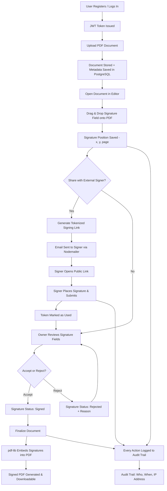

# 📄 DocSign — Document Signature App

A secure, full-stack digital signature platform that enables users to upload documents, place digital signatures, share signing links, and generate legally traceable signed PDFs — built as a 14-day structured project using the MERN-style stack (PostgreSQL instead of MongoDB).

---

## 📌 Introduction

The **Document Signature App** eliminates the need for physical paperwork by allowing documents to be signed electronically with full audit trails, signer identity verification, and document integrity. Inspired by platforms like **DocuSign** and **Adobe Sign**, it is designed with real-world enterprise workflows in mind — including authentication, document ownership, status tracking, and signature history.

This project demonstrates how modern SaaS products handle **file security, digital trust, and collaborative workflows** at scale, going beyond a typical CRUD app to model real business logic used in legal, HR, finance, and enterprise software.

---

## 🌍 Use Cases

| Domain | Examples |
|---|---|
| **Business Contracts & Agreements** | Vendors sign contracts remotely; status tracked as Pending / Signed / Rejected; signed documents stored securely |
| **HR & Onboarding** | Offer letters, NDA signing, policy acknowledgements |
| **Freelancers & Agencies** | Client agreements, proposal approvals, payment authorization documents |
| **Legal & Compliance Teams** | Legal documents with traceability, audit trails for disputes, IP-based signer tracking |
| **Education & Institutions** | Consent forms, admission documents, certificates and approvals |

### Core Problems This App Solves
- Manual document signing is slow and error-prone
- Physical paperwork is hard to track and store
- Emailing PDFs back and forth has no auditability
- No visibility into who signed, when, and from where
- Risk of document tampering after signatures

---

## 🏢 Industry Value

Companies actively hire for the skills this project demonstrates:

- **SaaS Architecture** — multi-user authentication, role-based document ownership, tokenized external access
- **Security & Compliance Thinking** — JWT authentication, audit trail implementation, protected document access, immutable signed outputs
- **Backend Engineering Depth** — file handling at scale, PDF manipulation, middleware logging, status workflows
- **Frontend Product Thinking** — drag-and-drop UX, PDF rendering, responsive dashboards, status-based UI filtering
- **Real Business Logic (Not Tutorials)** — document lifecycle management, signature coordinate mapping, final PDF generation, email/share workflows

This project sits in the same category as CRM systems, HR platforms, LegalTech software, and FinTech document systems — proving the developer can handle real-world complexity beyond simple CRUD apps.

---

## 🧱 Tech Stack & Reason

| Layer | Choice | Why |
|---|---|---|
| **Frontend Framework** | React (Vite) | Fast dev server, component-based UI, huge ecosystem for PDF rendering and drag-and-drop libraries |
| **Styling** | Tailwind CSS | Utility-first styling enables rapid, consistent UI development without writing custom CSS files |
| **Backend Runtime** | Node.js + Express | Lightweight, widely adopted, simple to wire up REST APIs and middleware (auth, audit logging, file uploads) |
| **Database** | PostgreSQL | Relational integrity matters here — documents, signatures, audit logs, and tokens all have strict foreign-key relationships; ACID guarantees protect against data corruption in a legal/compliance context |
| **Authentication** | JWT (access + refresh tokens) | Stateless, scalable auth that works well across both authenticated dashboard routes and short-lived public signing links |
| **File Storage** | Local disk (dev) | Simple to implement for a learning project; production apps would swap to S3/Supabase Storage |
| **PDF Engine** | pdf-lib | Pure JavaScript PDF manipulation — no external binaries needed to embed signature data directly into PDF bytes |

---

## 🛠️ Technologies Used

### Frontend
| Technology | Purpose |
|---|---|
| **React** | Component-based UI library powering the entire client app |
| **Vite** | Build tool and dev server — faster hot-reload than traditional bundlers |
| **Tailwind CSS** | Utility-first CSS framework for styling without writing separate stylesheets |
| **React Router DOM** | Client-side routing between pages (Login, Dashboard, Document Editor, etc.) |
| **Axios** | Promise-based HTTP client used to call backend REST APIs |
| **React Hook Form** | Lightweight form state management and validation for Login/Register forms |
| **react-pdf** | Renders PDF documents directly in the browser for preview and signature placement |
| **@dnd-kit/core** | Drag-and-drop library used to let users place and reposition signature fields on the PDF |

### Backend
| Technology | Purpose |
|---|---|
| **Node.js** | JavaScript runtime executing the server-side application |
| **Express** | Minimal web framework handling routing, middleware, and HTTP request/response logic |
| **PostgreSQL** | Relational database storing users, documents, signatures, audit logs, and signing tokens |
| **pg (node-postgres)** | PostgreSQL client/driver used to run parameterized SQL queries from Node |
| **bcryptjs** | Hashes user passwords before storing them in the database |
| **jsonwebtoken (JWT)** | Issues and verifies access/refresh tokens for authenticated routes |
| **Multer** | Middleware that handles multipart/form-data PDF file uploads |
| **pdf-lib** | Embeds signature text/boxes directly into the PDF's byte structure to produce a finalized signed document |
| **Nodemailer** | Sends signing-link emails to external signers via SMTP |
| **crypto (Node built-in)** | Generates secure random tokens for tokenized public signing links |
| **cors** | Enables cross-origin requests between the frontend (port 5173) and backend (port 5000) |
| **dotenv** | Loads environment variables (DB credentials, JWT secrets, email config) from `.env` |

---

## 🔄 How the App Works

### Step-by-step flow
1. **Authentication** — User registers/logs in; backend issues a JWT access token and refresh token.
2. **Upload** — User uploads a PDF via Multer; file is stored on disk and metadata saved in PostgreSQL.
3. **Editing** — User opens the document in the editor, drags signature fields onto the PDF using `dnd-kit`, and each field's coordinates are saved as a percentage of the page (so it scales correctly regardless of PDF size).
4. **Sharing (optional)** — Owner can generate a tokenized, expiring signing link and email it to an external signer via Nodemailer; the signer opens the link, places their signature, and submits — no login required.
5. **Status Management** — The document owner reviews each signature field and can Accept, Reject (with a reason), or Reset it.
6. **Finalization** — Once ready, the owner finalizes the document; `pdf-lib` reads the original PDF bytes and embeds each signature directly into the file, producing a new immutable signed PDF available for download.
7. **Audit Trail** — Every significant action (upload, view, signature placed, link generated, document signed, finalized) is logged with a timestamp, user, and IP address, viewable on a dedicated Audit Trail page.

---

## ✅ Conclusion

The Document Signature App demonstrates that a project doesn't need to be a "simple CRUD app" to be an effective learning and portfolio tool. By modeling a real DocuSign-style workflow — secure authentication, file handling, coordinate-based signature placement, tokenized external access, immutable PDF generation, and full audit logging — this project covers the same architectural concerns found in production SaaS systems across LegalTech, HR tech, and FinTech.

Built incrementally over a structured 14-day plan, it shows not just the ability to write code, but the ability to **reason about document lifecycles, security boundaries, and compliance-driven features** — the kind of product-aware engineering that stands out in real interviews and real teams.